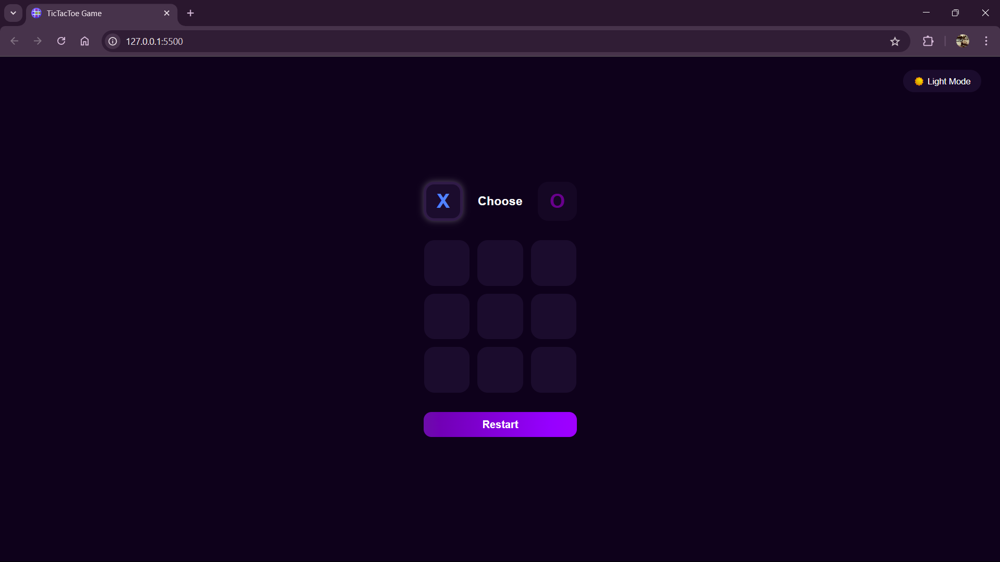

# 🎮 Tic Tac Toe Game

A classic **Tic Tac Toe (Noughts and Crosses)** game built using **HTML, CSS, and JavaScript**. This fun and interactive project allows two players to take turns marking spaces in a 3×3 grid, trying to get three in a row.

---

## 🛠️ Technologies Used

- HTML5
- CSS3 (with transitions and hover effects)
- JavaScript (DOM Manipulation and Game Logic)

---

## ✨ Features

- Two-player functionality (Player X and Player O)
- Turn-based logic with player indicator
- Win and draw detection
- Reset button to restart the game
- Responsive design for all screen sizes
- Visual feedback for winning line

---

## 📷 Demo

> Optionally include a short screen recording or link to live demo:
> 🔗 [Live Demo](https://your-live-demo-link.com)

---

## 📁 Project Structure
# Author - Kunal Kushwaha
